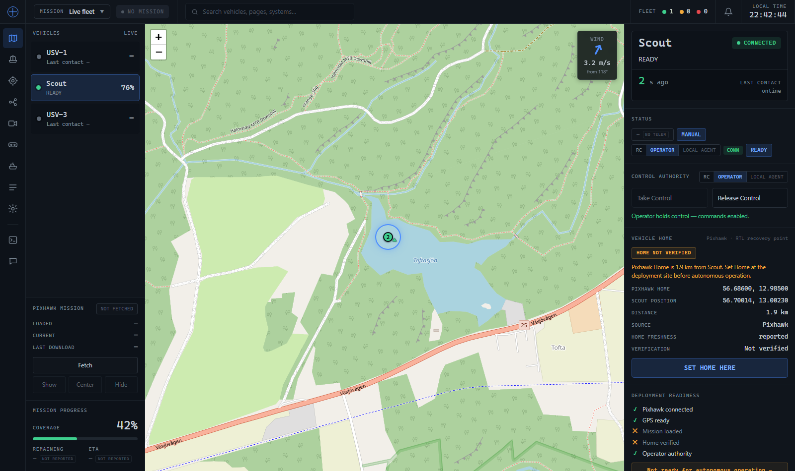
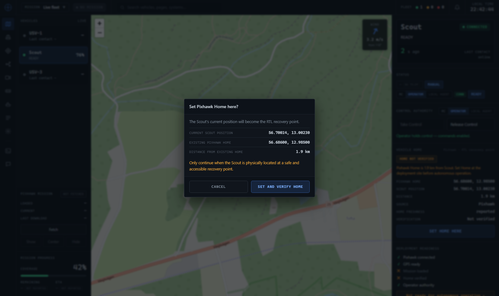
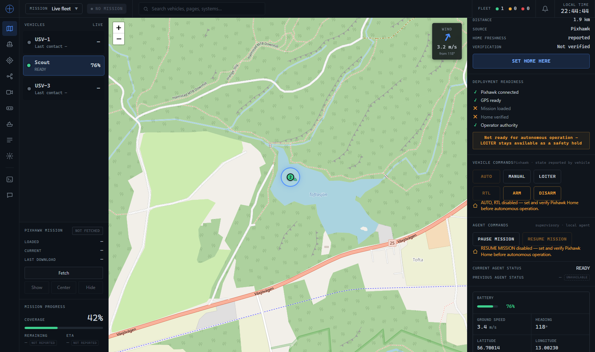
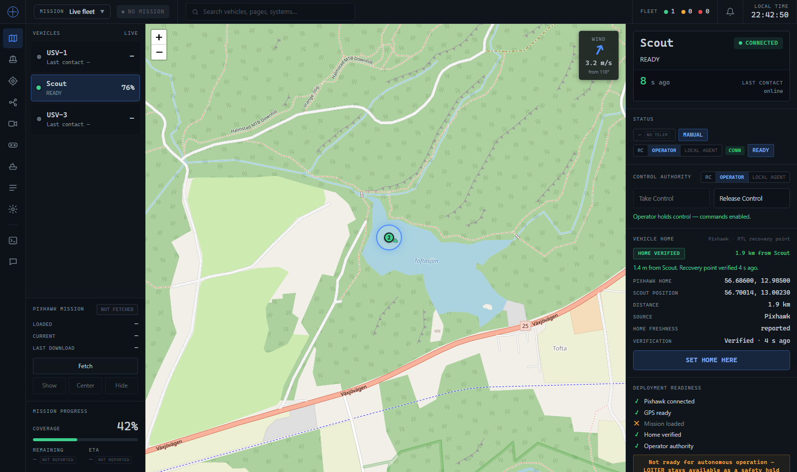

# Verification — Set Home Here (deployment workflow)

Adds the lake-deployment workflow to the Map page inspector: set + read-back-verify the
Pixhawk `HOME_POSITION` (RTL recovery point) at the deployment site, and gate autonomous
commands on that verification. LOITER is deliberately never gated (anti-drift safety).

## Two independent things — never conflate them

1. **The permanent Home-verification state** (what the Mission card's Home chip and the
   Deployment readiness checklist show) comes SOLELY from Scout's own, continuously-
   reported `payload.agent.home_status` — normalized verbatim by `main.home_block()`.
   The operator backend never computes, latches, or reconstructs this itself.
2. **The SET_HOME command** (what "Last command" / a toast shows immediately after a
   click) is a normal queued command. Its transport status reaching `EXECUTED` means
   only "the Local Agent successfully called Scout Flask" — it is NOT proof Set Home
   succeeded. The command's own nested Scout result is classified separately
   (`main._annotate_set_home_result`) purely for immediate click feedback, and never
   writes into (1).

If Scout stops reporting `home_status` — link lost, Scout/Pixhawk restarts — the very
next packet's absence (or an explicit `verified:false`) is what un-verifies the UI. A
command that once succeeded never keeps the UI claiming Home is verified on Scout's
behalf.

## What is real vs. a backend gap

- **Live**: the command queue (QUEUED/SENT/EXECUTED/FAILED/REJECTED/EXPIRED), the
  command's own `home_result` classification (verified/failed, for the toast/pending
  flash only), command gating, readiness, the map marker, and the whole `home_block()`
  read-side (it correctly renders whatever `payload.agent.home_status` it's given,
  including "not reported yet", stale-fallback, and restart-invalidated states).
- **Backend gap**: the Local Agent (1) executing `SET_HOME` off the queue (issuing
  `MAV_CMD_DO_SET_HOME` via Scout Flask, reading `HOME_POSITION` back, and posting a
  result in the real contract shape below) and (2) forwarding Scout's continuous
  `home_status` on every status packet are not shipped in this repo yet — see
  `BACKEND_ROADMAP.md`. Until they are, a queued `SET_HOME` command sits QUEUED/SENT and
  the Home chip reads "Scout does not report Home status yet." — never a claimed
  success. The screenshots below were produced against a local Local-Agent stub
  (verification harness) that claims the command, posts a result, and forwards
  `home_status`.

## API contract

### 1. The SET_HOME command (immediate feedback only)

No dedicated route, no direct HTTP call to Scout from the operator backend — exactly
the same command infrastructure as AUTO/RTL/LOITER/ARM/DISARM/PAUSE/RESUME:

1. `POST /api/commands`  body `{ vehicle_id, type: "SET_HOME", params?: { lat, lng },
   confirm: true }` (confirm is required — SET_HOME is in `CONFIRM_REQUIRED_TYPES`,
   same as ARM/DISARM) → `{ ok, command }`, `command.status` is `QUEUED`. The backend
   (`main.create_command` → `_canonical_set_home_params`) rewrites `params` for every
   `SET_HOME` to the canonical `{ mode: "current_position", requested_position?: { lat,
   lng } }` regardless of what was sent — Scout picks and verifies its OWN current
   position; any lat/lng supplied is kept only as non-authoritative audit metadata under
   `requested_position`, never as the target (see `commands.md`, "Command-result contract
   hardening + SET_HOME canonicalization").
2. The Local Agent claims it via `GET /api/commands/pending/{vehicle_id}` (QUEUED → SENT).
3. The Local Agent reports the outcome via `POST /agent/command_result` or
   `POST /api/commands/{id}/result` — `status` ∈ `ACCEPTED|EXECUTED|REJECTED|FAILED`,
   with the REAL Scout Set Home result nested under `result`:
   ```json
   {
     "accepted": true, "verified": true,
     "requested_position": { "latitude": 56.7, "longitude": 13.0 },
     "home_position": { "latitude": 56.700001, "longitude": 13.000001, "altitude": 12.0 },
     "verification_distance_m": 1.4,
     "ack_result": "MAV_RESULT_ACCEPTED", "error": null
   }
   ```
   A failure may still arrive with the OUTER command status `EXECUTED` (the call to
   Scout Flask itself worked fine; Set Home did not):
   ```json
   { "accepted": false, "verified": false, "home_position": null,
     "verification_distance_m": null,
     "error": { "code": "ACK_TIMEOUT", "message": "No ack from the Pixhawk." } }
   ```
4. `main._annotate_set_home_result` classifies that nested result into
   `cmd["home_result"]` = `"verified"` only when ALL of: `accepted === true`,
   `verified === true`, `home_position` has a usable latitude/longitude, and
   `verification_distance_m` is present and within `HOME_VERIFY_TOLERANCE_M` (5 m) —
   otherwise `"failed"`, with `cmd["reason"]` replaced by Scout's real
   `error.message`/`error.code`. **This never falls back to the requested `params.lat`/
   `params.lng`** — those prove what was asked for, not what Pixhawk returned — and it
   does not honor the old field names `result.home`/`result.distance_m` (no backward
   compatibility). It never writes to the permanent Home state either way.

Poll `GET /api/commands/{vehicle_id}` (or the terminal-only
`GET /api/commands/history/{vehicle_id}`) to watch the command's lifecycle — the Map
page's "Last command" line reads `cmd.home_result` (not a bare `EXECUTED`) so a
verification failure never displays as "confirmed", exactly like AUTO/RTL/ARM/DISARM's
lifecycle display otherwise.

### 1b. The pending flash always terminates (no permanent "Setting…")

Because the Local Agent does not execute `SET_HOME` off the queue yet (the backend gap
above), the realistic case today is a command that NEVER reaches `EXECUTED`. The button
must not present that as an in-progress action forever, so `setHomeOutcome`
(`lib/home.js`, pure + unit-tested) bounds every wait:

| Situation | Resolves to | After |
|---|---|---|
| `EXECUTED` + `home_result: "verified"` | `confirmed` | immediately |
| any terminal status (incl. backend `EXPIRED`) | `failed`, carrying Scout's real reason | immediately |
| Scout never reports a result | `failed` / `timeout` | the command's own `expires_at` (backend `COMMAND_TTL_S`, 300 s) + 5 s |
| the tracked record vanishes (operator backend restarted — the queue is in-memory) | `failed` / `lost` | 15 s |
| the `POST` never confirms a queued command (`fetch` has no timeout) | `failed` / `not_queued` | 15 s |

The deadline is **read off the command's `expires_at`**, never invented client-side, so
the client and the backend cannot disagree about when a command is dead; the 5 s slack
lets the backend's own `EXPIRED` (which carries the real reason) win the race. The
client deadline is a backstop for when no status arrives at all — including when the
command poll itself is down, which is why a 1 s watchdog in `Map.js` evaluates it
independently of any feed.

Timeout copy never claims Home was or was not set — on a timeout the operator genuinely
does not know — so it says the Home state is unknown and to re-check before AUTO/RTL.

### 2. The permanent Home status (`payload.agent.home_status`)

Reported continuously by the Local Agent/Scout Flask on every status packet:
```json
{ "verified": true, "verified_at": "2026-07-15T10:00:00Z",
  "verification_method": "READBACK", "verification_distance_m": 1.2,
  "ready_for_auto": true, "ready_for_rtl": true, "reachable": true,
  "home_position": { "latitude": 56.7, "longitude": 13.0, "altitude": 10.0 },
  "reason": null }
```
`main.home_block(vid, payload, telemetry)` mirrors these fields verbatim onto the fleet
payload's `home` block (`verified`, `verified_at`, `verification_method`,
`verification_distance_m`, `ready_for_auto`, `ready_for_rtl`, `reason`, `home_position`,
`reachable`, plus convenience `lat`/`lng`/`available`), with one rule layered on top:
`verified`/`ready_for_auto`/`ready_for_rtl`/`verified_at` are forced to
false/false/false/null whenever the status is **stale** — either (a) the current status
packet omitted `payload.agent.home_status` and the block fell back to the last one
Scout sent (`main.last_known_agent`, the same last-known cache the Agent page already
uses), or (b) the vehicle itself isn't `CONNECTED`. A stale status is displayed as
unverified, never silently trusted as still current — this is what makes a Scout/Pixhawk
restart (which stops or resets `home_status`) immediately clear the UI's verified state
rather than latching the last good reading.

## UI states


HOME NOT VERIFIED — Pixhawk Home 1.9 km from Scout; coords, distance, freshness,
verification rows; SET HOME HERE enabled (operator holds control); readiness checklist.


Confirmation dialog — current Scout position, existing Pixhawk Home, distance, safety
caution, CANCEL / SET AND VERIFY HOME. Not a one-click action.


Interlock while unverified — AUTO / RTL / RESUME MISSION disabled with the reason;
LOITER, MANUAL, ARM/DISARM, PAUSE stay enabled; readiness banner notes LOITER remains a
safety hold.


After SET AND VERIFY HOME — HOME VERIFIED (~1.4 m from Scout), marker turns green,
AUTO/RTL/RESUME unlocked, Home verified ✓ in the readiness checklist.

## Manual steps (against a live Scout)

1. Load the mission; place the Scout in the water at a safe recovery point; wait for a
   valid GPS fix (Scout CONNECTED, position shown).
2. Take Control (OPERATOR). Confirm `SET HOME HERE` becomes enabled and AUTO/RTL/RESUME
   are disabled with "set and verify Pixhawk Home…".
3. Press `SET HOME HERE` → dialog. Press CANCEL — confirm no request is sent and Home
   stays NOT VERIFIED.
4. Press `SET HOME HERE` → SET AND VERIFY HOME. Observe SETTING HOME (pending), then
   HOME VERIFIED with the read-back distance and time.
5. Confirm AUTO/RTL/RESUME are now enabled, the marker is green, and readiness shows
   Home verified ✓. Confirm LOITER was enabled throughout.

## LOITER as the primary safety hold

LOITER (active station-keeping / anti-drift) is the Scout's primary safety hold and is
presented as such on both command surfaces; the passive `SET_MODE_HOLD` (kept for backend
compatibility) is demoted, never shown as LOITER's equal. Taxonomy lives in `lib/home.js`
(`SAFETY_HOLD_TYPE`, `PRIMARY_MODES`, `ADVANCED_MODES`).

- **Map** — primary modes `AUTO · MANUAL · LOITER · RTL` (no HOLD); LOITER carries a green
  "safety" style and stays enabled while AUTO/RTL/RESUME are Home-gated. The one
  permanent Home indicator is the Deployment readiness checklist (`NOT READY` banner);
  the Home-gated buttons explain themselves on hover only (AUTO: "Set and verify Home
  before AUTO.", RTL: "RTL requires a verified Home.", RESUME: "Verify Home before
  resuming."), LOITER's hover reads "Active anti-drift safety hold. Always available." —
  no separate persistent banner duplicates these any more.
- **Vehicle** — primary row `AUTO · MANUAL · LOITER · RTL · PAUSE · RESUME · ARM · DISARM`;
  HOLD + GUIDED moved into a collapsed **Advanced modes** group with a note that HOLD is a
  passive hold (may drift) and LOITER is the active anti-drift hold.

## Automated coverage

- Backend: `python -m unittest tests.test_set_home tests.test_mode_commands` (32 tests —
  SET_HOME as a queued command with no synchronous Scout call; `_annotate_set_home_result`
  classification (outer EXECUTED + `verified:false`/`accepted:false`/missing
  `home_position`/out-of-tolerance/an `ACK_TIMEOUT` error are all "failed", never a
  fabricated success; the old `result.home`/`result.distance_m` names are not honored);
  idempotency; and `home_block()` reading `payload.agent.home_status` verbatim, including
  a stale last-known fallback forcing `verified:false`, a restart-invalidated packet
  clearing verified state, and a command's own result/failure never touching Scout's own
  truth. LOITER routes as `SET_MODE_LOITER` with no forced confirmation; HOLD still
  accepted for compatibility.
- Frontend: `npm test` (37 tests — home status + gating policy; the in-flight `SET_HOME`
  resolution above, including a GUARANTEE test that no input can pend past the fallback
  TTL, that a bare `EXECUTED` is a failure, and that the deadline follows the command's
  own `expires_at` rather than a client-invented number; a stale `v.home` is never
  surfaced as verified and a command's "confirmed" click-feedback phase never forces
  `state` to verified; LOITER is the safety hold and in `PRIMARY_MODES`, HOLD is
  advanced-only, LOITER enabled when Home unverified/readiness false while AUTO/RTL/RESUME
  stay disabled).
