# UAV companion via Scout — operator side

Scope: operator-station UAV companion integration — optional companion block on
`POST /agent/status`, validation, per-parent storage, freshness, dock indicator, companion
panel, UAV position and hazard overlays, opt-in fixture, integration contract. No serial
radio, UAV control, perception or replanning execution. Scout code (`Scout-USV-scripts/`,
`_scout_ref/`) was not touched. Contract: `COMPANION_CONTRACT.md` (reference) /
`SCOUT_INTEGRATION_HANDOFF.md` (concise, for the Scout-side developer).

Three passes, in order below: phase 1 (`companion-v1`, superseded), the **v2 follow-up**
(freshness model + session/seq ordering), then **v2, second pass** (publisher generations +
honest STALE/UNCERTAIN/UNKNOWN freshness classification) — read that last section first for
the current state.

## Backend
- [x] `companion_telemetry.py` — pure module: validation, omission vs clear, snapshots,
      per-measurement `observed_at`, clock-offset-free ages, never-regress ordering, bounds.
- [x] `main.py` — `companion_state_by_id` keyed by parent; ingest only in the accepted
      (monotonic-guarded) branch; `companions` on every fleet row, never-contacted included.
- [x] `main.py` — `_finite_only()` on ingest: a NaN anywhere in a status packet used to make
      `GET /api/fleet/status` fail for the whole fleet (echoed via `raw`, serialized with
      `allow_nan=False`). Found by the companion NaN test; applies to every group.

## Frontend
- [x] `lib/companion.js` — states ACTIVE / IDLE / STALE / LOST / UNKNOWN, position/hazard
      staleness, disposition + replan wording, map plan keyed `${parentId}::${companionId}`.
- [x] `components/CompanionPanel.js` — dock tab + read-only panel (only button: close).
      Originally a text chip; replaced by a compact right-edge TAB in the v3 pass below —
      read that pass for the current presentation, not this line.
- [x] `VehicleDock` — tab opt-in (`{ companions: true }`); other pages' docks unchanged.
- [x] `Map.js` — panel (selected vehicle only, closed on switch), UAV marker, hazard pane
      (z 398: above the original plan, below the live route), legend, cleanup.

## Browser verification (Playwright, headless, `/app/#/map`, fresh backend, opt-in fixture)

| Scenario | Observed |
|---|---|
| legacy Scout + SAR | no chip, no companion layers |
| assigned, no contact | `UAV · UNKNOWN`; panel "No contact yet", position/battery "not reported" |
| active inspection | `UAV · ACTIVE`; diamond UAV marker; panel: link, activity/task/route rev, 71 %, position + "25 m AGL · observed N s ago", inspection 40 % "Scout-reported" |
| proposed buoy | amber dashed exclusion + uncertainty circle + point; tooltip "PROPOSED — NOT ACCEPTED", "Replanning: not reported", source, age, ±8 m (95 %), revision 1 |
| accepted + replanning | magenta; panel "Accepted by Scout as exclusion" / "Replanning in progress" |
| replan verified | tooltip "Revised mission verified by Scout (rev 4)", revision 3 |
| duplicate / out-of-order | still 3 hazard shapes (no duplicates); older UAV position ignored |
| UAV link lost | `UAV · LOST`; marker dashed with live age; battery/position "LAST KNOWN · 17 s" |
| select SAR | SAR has no chip; companion panel closes |
| Scout silent ~35 s | `UAV · STALE`; "Scout is not in contact — this is what it last reported 36 s ago"; link "last reported Connected"; hazards at half opacity; marker tag 37 s |

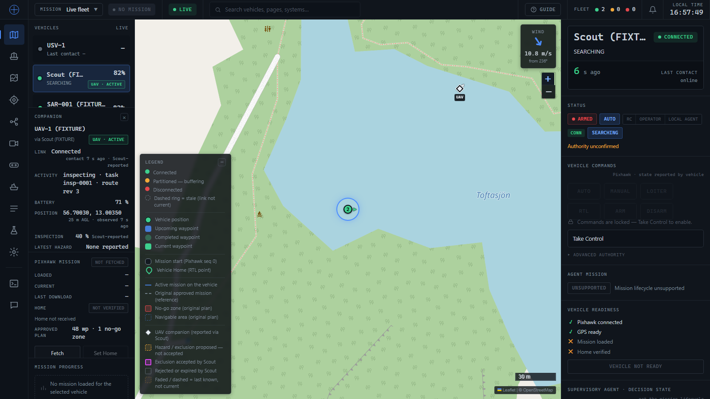
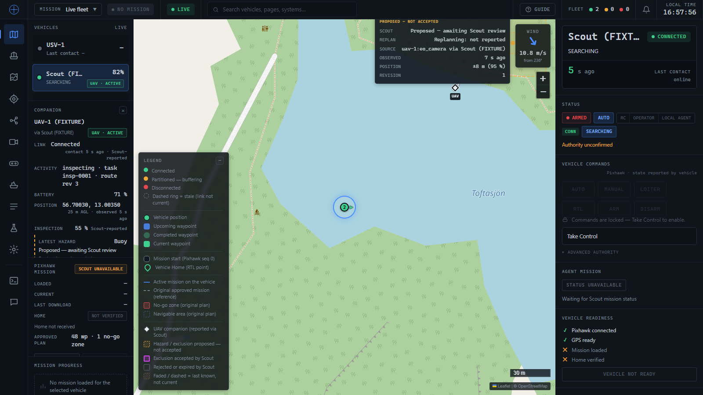
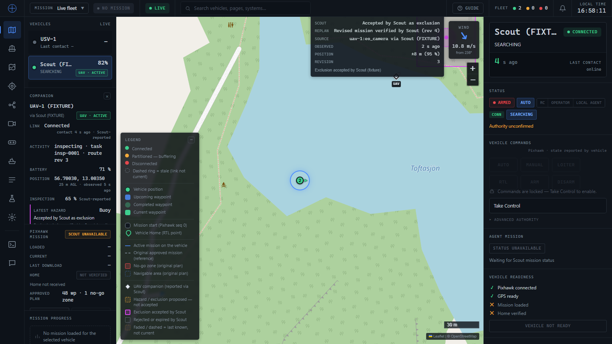
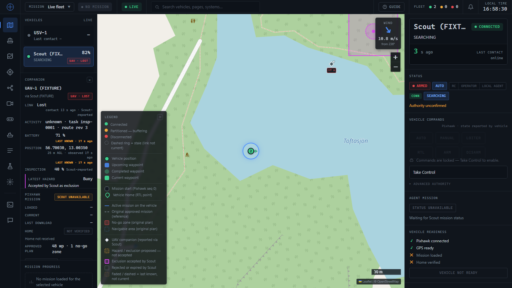
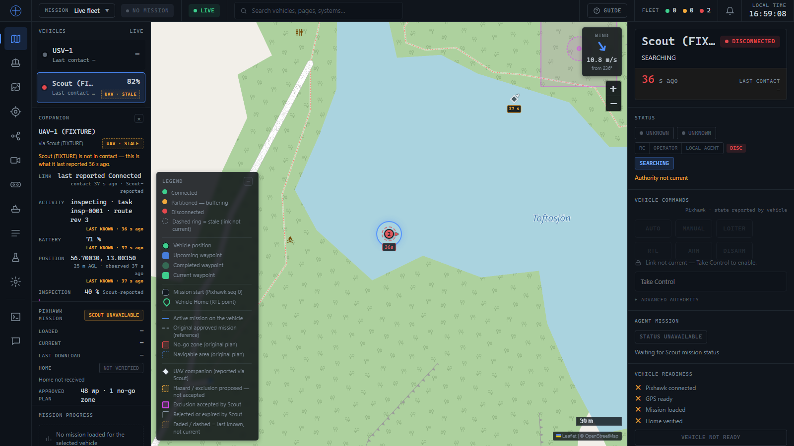

Page errors: none. The only 5xx responses were `/api/vehicles/{2,3}/mission-execution/status`
(503): the existing Scout proxy, with no real Scout reachable. Unrelated to this change.

Found and fixed during verification:
- `new Map()` inside `Map.js` recursed into the page function (`export function Map`) —
  blank page. Plain object now, and a regression test forbids the construct.
- A stale UAV marker's age tag froze (layer rebuilt only on drawn-state change). The icon is
  now refreshed in place every poll.
- An open panel squeezed the roster; capped at 32 % of the dock and scrolls internally.

## Automated
- `python -m unittest tests.test_companion_telemetry` — 39 tests: compatibility, contract,
  freshness vs arrival, clock offset, ordering/duplicates, clear vs omission, validation
  bounds, NaN, isolation, no command/mission/draft side effects.
- `tests/companion.test.mjs` — 22 tests: states, isolation, freshness, hazard classes,
  replan text, dedupe, layer signature, panel content/escaping, dock chip, Map wiring.
- Full suites: `npm test` 1029 passed; `python -m unittest discover -s tests` 1375 OK
  (includes the production-mission-store isolation run of the whole suite).

## Limitations / not verified (phase 1)
- No real Scout sends this block yet; everything above is fixture-driven.
- Leaflet is loaded unpinned from unpkg (pre-existing); function tooltips need Leaflet 1.x.
- With the panel open on a 900 px-high screen, the third roster row needs a scroll.
- Out of scope, not rendered: inspected coverage, UAV track, RSSI, any UAV command.

---

# v2 follow-up — freshness model + snapshot ordering

Scope: strengthened the reporting contract for Scout integration readiness.
1. **Freshness correctness** — the old `age_s` silently assumed zero delivery delay (an
   envelope delayed 30 s in transit read as ~0 s old the instant it arrived). Replaced with
   three explicit numbers (`min_age_s`, `reporting_delay_s`, `estimated_age_s`) plus
   `freshness_quality`/`clock_anomaly`, computed with the local-elapsed component on
   `time.monotonic()`, not wall clock.
2. **Snapshot ordering** — added `companions.session {id, seq}`: per-hazard `revision`
   protects one object's content, not membership. A newer envelope carrying an older
   companion snapshot (stale `seq`, same `session.id`) is now rejected wholesale; a
   different `session.id` is trusted as a publisher restart (never ordered lexically).
3. **Removal reliability** — corrected the "send `items: []` once" instruction: Scout must
   keep resending its current (possibly empty) truth every packet, so one lost "clear"
   packet cannot leave a stale assignment on screen forever.
4. **Reporting-contract/radio-protocol separation** — documented in `COMPANION_CONTRACT.md`
   §1: this is Scout→operator only; not a mandate to broadcast full polygons over radio.
5. **`SCOUT_INTEGRATION_HANDOFF.md`** — new, concise, example-first document for the
   Scout-side developer (separate audience from the exhaustive reference).

This is a deliberate, breaking schema revision (`companion-v2`); `companion-v1` (never
adopted by any real Scout build) is now rejected like any other unrecognised schema.

## Backend (v2 additions)
- [x] `companion_telemetry.py` — `_receipt()`/`_evidence()`/`_freshness()` (three-number
      model), `_mark()`/`_elapsed()` (monotonic-clock bookkeeping), `_validate_session()` +
      `_apply_session()` (snapshot ordering policy, fully documented in the module docstring
      and code comments — including the one acknowledged gap: a session change in an
      envelope with no timestamp has no ordering protection, same as `main.py`'s own guard).
- [x] `main.py` — threads `time.monotonic()` through `ingest()`/`fleet_block()` alongside
      the existing wall-clock `time.time()`.

## Frontend (v2 additions)
- [x] `lib/companion.js` — `evidenceView()`: the one place the three backend numbers become
      a staleness verdict + display text ("Ns ago" / "at least Ns ago (delivery delay ~Ds)"
      / "timing unknown"). Staleness uses the delay-inclusive `estimated_age_s`, never
      `min_age_s` alone, so a delayed envelope can never read as falsely fresh.
- [x] `CompanionPanel.js` / `Map.js` tooltips — consume `.ageText` directly; a `clock_anomaly`
      flag renders a distinct "⚠ clock mismatch" note, separate from staleness.

## Found during this pass
- **`main.py`'s pre-existing per-vehicle envelope-timestamp guard has no upper bound.** An
  envelope timestamped ~30 s in the future is accepted and raises that vehicle's high-water
  mark into the future; every subsequent NORMAL-timestamped packet is then rejected as stale
  by that OUTER guard (before `companion_telemetry.py` ever runs) until real time catches up.
  This is a property of the existing guard (not touched, per the task's explicit
  instruction not to weaken it) — documented in `COMPANION_CONTRACT.md`'s Limitations,
  regression-tested
  (`test_clock_discontinuity_via_the_real_endpoint_poisons_the_outer_guard_not_this_module`),
  and the fixture's `clock_discontinuity` scenario was moved to run LAST in `ALL_ORDER` so it
  doesn't poison every other scenario in a `--scenario all` run.
- `companion_fixture.py`'s `uav()` builder hardcodes `display_name: "UAV-1 (FIXTURE)"`
  regardless of `companion_id` — cosmetic only (the `session_restart` scenario's replacement
  companion, `uav-2`, still shows the old display name in the panel even though its state —
  link/activity/position — is genuinely the new companion's). Not fixed; noted here since it
  was visible during browser verification below.

## Browser verification (v2 scenarios; Playwright, headless, fresh backend, opt-in fixture)

| Scenario | Observed |
|---|---|
| delayed delivery (~30 s transit) | chip `UAV · STALE`; panel "contact at least 3 s ago (delivery delay ~30 s)" on link/battery/position — never read as fresh |
| unknown timing (no envelope timestamp) | "contact timing unknown"; "Envelope carried no timestamp — freshness cannot be judged." |
| clock discontinuity (envelope ~30 s ahead) | "⚠ clock mismatch" on link/battery/position; confirmed in raw state (`clock_anomaly: true`) |
| session restart (new session id, seq resets) | old companion's ACTIVE/CONNECTED state fully replaced by the new session's UNKNOWN/NEVER_CONNECTED companion — no merge with the retired session |
| stale snapshot replay (older seq, same session, inside a newer envelope) | the seq-3 VERIFIED/ACCEPTED hazard **survived** the seq-0 replay attempt untouched — confirmed both in an isolated backend probe and in the browser |
| repeated clear after a dropped first "clear" packet | chip disappears, panel "No companion reported" — the *second* (repeated) clear succeeded even though the first was never sent |
| vehicle switching during all of the above | companion panel closes on switch; SAR-001's own row never shows Scout's chip |

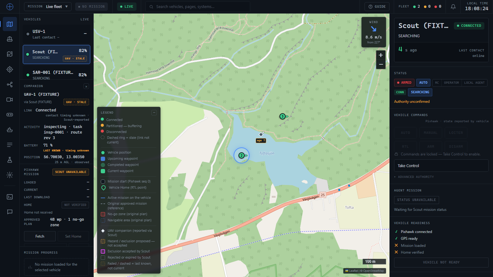
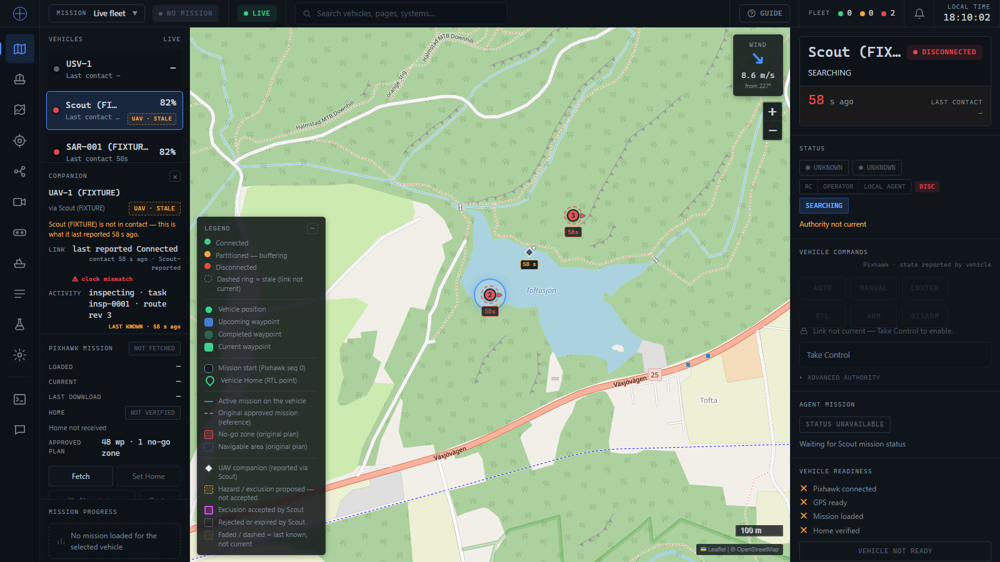

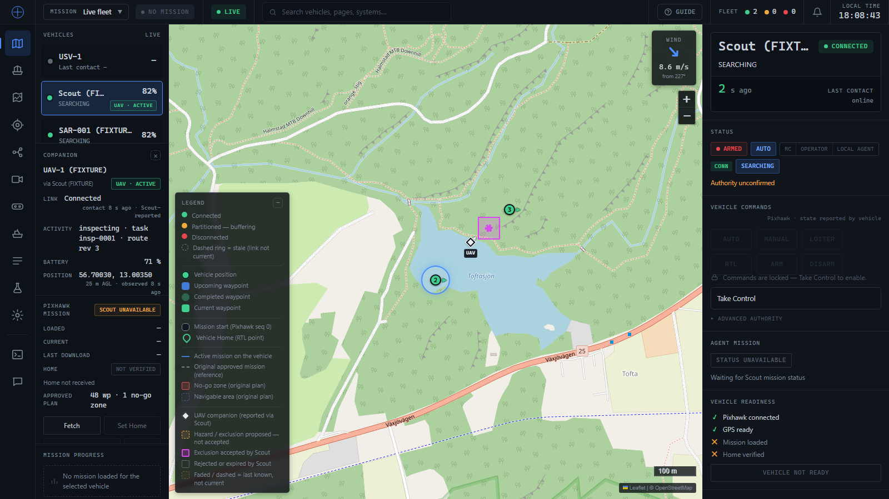
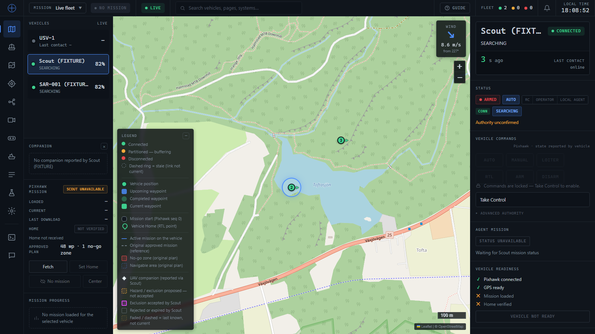

Page errors: none new. The only 5xx responses were the pre-existing
`/api/vehicles/{2,3}/mission-execution/status` 503s (no real Scout reachable).

## Automated (v2)
- `python -m unittest tests.test_companion_telemetry` — 57 tests (was 39): adds
  `SnapshotOrdering` (9 tests: old/duplicate/equal seq, hazard omission/restoration,
  publisher restart, two-vehicle isolation, non-lexical session ordering, malformed
  session), rewrites `Freshness` (delayed delivery, duplicate delivery, clock offset,
  clock discontinuity, monotonic-clock-not-wall-clock, the guard-interaction finding above),
  adds a `ClearVsOmission` test for the repeated-clear-after-drop fixture scenario and one
  for malformed-transfer-not-treated-as-clear, and a `BackwardCompatibility` test that
  `companion-v1` is explicitly rejected.
- `tests/companion.test.mjs` — 25 tests (was 23): `evidenceView()` behaviour (guaranteed
  lower bound, notable-delay wording, unknown-quality, clock-anomaly passthrough), updated
  staleness/hazard/panel tests for the new evidence shape, panel delivery-delay and
  clock-mismatch rendering.
- Full suites (this pass): `npm test` 1032 passed; `python -m unittest discover -s tests`
  1393 OK (includes the production-mission-store-isolation subprocess re-run of the whole
  suite).

## Limitations / not verified (v2)
- No real Scout sends this block yet; everything above is fixture-driven.
- No field exists yet for Scout to supply its own clock-offset/delivery-delay evidence
  beyond what the operator can already compute from the envelope timestamp (documented as
  future/optional in both contract documents).
- The session/seq ordering guarantee depends on Scout always sending an envelope timestamp;
  an envelope with none bypasses `main.py`'s own guard entirely, and a session change in
  such a packet inherits that same lack of protection (documented, not fixed — see "Found
  during this pass" above).
- `companion_fixture.py`'s cosmetic display-name issue (above) was not fixed.

---

# v2, second pass — publisher generations + honest freshness classification

Scope: two further corrections found while exercising the first v2 pass, before Scout ever
adopted it, plus everything required to update its own docs and tests to match.

1. **A retired publisher could come back.** The first v2 pass trusted ANY different
   `session.id` as a genuine restart. That allowed: session A accepted → session B (a real
   restart) supersedes it → a DELAYED session-A snapshot, arriving inside a still-newer
   envelope, was wrongly trusted again as "another restart" and could silently undo B's
   state. Fixed by replacing id-trust with an explicit `session.generation` integer that
   Scout persists across its own restarts and increases on every one — compared **only**
   numerically, never by comparing ids. A conflicting id at the SAME generation
   (`inconsistent_session_generation`) is now rejected wholesale, including no liveness
   update. Ordering state (`{id, seq, generation}` only, never companion data) now survives
   an **operator** restart too, via `runtime_data/companion_sessions.json` (atomic write,
   fail-closed load, isolated from the mission store's own persistence).
2. **A small lower-bound age was implicitly readable as "fresh".** `estimated_age_s` mixes
   real delivery delay with Scout/operator clock offset and the two can cancel out (Scout's
   clock 30 s ahead + a genuine 30 s delivery delay computes to 0 s of "delay"). Replaced the
   old two-state fresh/stale decision (which used `estimated_age_s`) with a three-way
   classification that uses **only** `min_age_s`, the clock-offset-immune guaranteed lower
   bound: **STALE** (proven, `min_age_s` over threshold), **UNCERTAIN** (a small/known lower
   bound that does NOT prove currency), **UNKNOWN** (no envelope timestamp at all — treated
   with the same "cannot present as current" protection as STALE). There is still, and now
   more explicitly, no system-asserted **FRESH** state anywhere. `freshness_quality` renamed
   `"BOUNDED"` → `"LOWER_BOUND"` so it can no longer be misread as a maximum-age guarantee.

No layout redesign: the existing chip/panel/marker components and CSS classes were reused
(new `uncertainNote()` caveats render through the already-existing muted `.cmp-sub-i` style).

## Backend (this pass)
- [x] `companion_telemetry.py` — `_session_conflict()` (same-generation/different-id
      detection), rewritten `_apply_session()` (generation compared numerically, seq ordering
      unchanged within a generation), `session_snapshot()` / `seed_session()` /
      `validate_session_snapshot()` (persistence primitives — pure, no I/O; the caller owns
      the file).
- [x] `main.py` — `_save_companion_sessions()` / `_load_companion_sessions()`: atomic
      temp-file + `os.replace` + `fsync` write (same convention as `_save_mission_store()`),
      fail-closed load (same convention as `_load_mission_store()`), invoked from `lifespan()`
      and only on an accepted generation change (not every seq bump — a known, documented
      residual gap, see Limitations).

## Frontend (this pass)
- [x] `lib/companion.js` — `evidenceView()` rewritten around `min_age_s` only; returns
      `state: "STALE" | "UNCERTAIN" | "UNKNOWN"` plus `uncertain`/`stale` booleans;
      `companionStatus()`'s CONNECTED branch no longer treats a small-but-UNCERTAIN
      peer-contact age as disproving reachability (falls through to Scout's own claimed
      `activity`/`link` state instead, never presented as independent proof of freshness).
- [x] `CompanionPanel.js` — new `uncertainNote()` caveats on link/battery/position/hazard
      rows when evidence is UNCERTAIN, distinct from the amber `LAST KNOWN` treatment
      reserved for PROVEN-stale/UNKNOWN evidence.

## Browser verification (this pass; Playwright, headless, fresh backend + cleared
`runtime_data/companion_sessions.json`, opt-in fixture, one fixture process at a time)

| Scenario | Observed |
|---|---|
| uncertain timing (`delayed_delivery`: `min_age_s`≈1 s, `reporting_delay_s`≈30 s) | dock chip stays `UAV · ACTIVE` (Scout's own claim, not a freshness assertion); panel shows "contact at least <1 s ago (delivery delay ~30 s)" with the caveat "Contact evidence is a lower bound only — current reachability is not independently confirmed."; battery "71 % · recency not confirmed"; position "Reported position — not a confirmed current fix." No `LAST KNOWN` anywhere — evidence is UNCERTAIN, not proven stale |
| proven stale (`uav_link_lost`: `min_age_s`≈23–35 s, over the 15 s threshold) | chip `UAV · LOST`; panel `LINK Lost`, battery/position both `LAST KNOWN · at least Ns ago`; a hazard whose own `min_age_s` was still under threshold correctly showed the UNCERTAIN caveat instead, in the same panel — the two states coexist correctly per-field |
| session-replay rejection (`retired_generation_replay`: A gen 1 accepted → B gen 2 accepted, replacing A → A's own old generation replayed repeatedly inside newer envelopes) | B's state (`uav-2`, CONNECTED, INSPECTING) survived every replay attempt untouched; confirmed in the raw fleet API (`rejections.by_reason.retired_session_generation` climbing with every replay tick, `session.generation` staying at 2, `items` never reverting to the retired companion) and in the panel (link/activity match B, never A's LOST) |

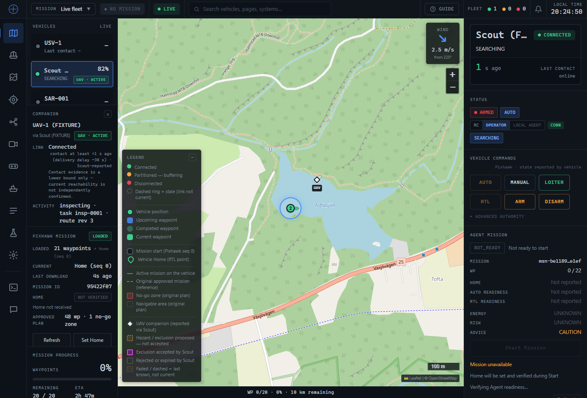

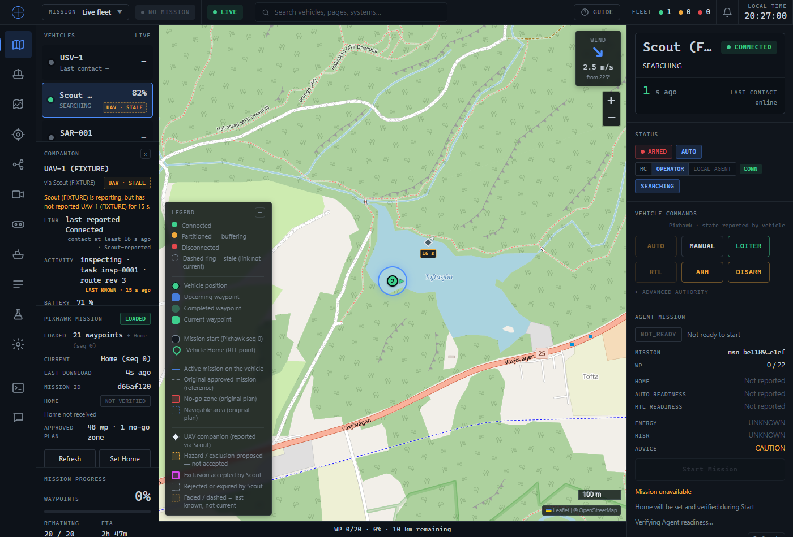

Page errors: none new (the pre-existing `/api/vehicles/{2,3}/mission-execution/status` 503s
persist, unrelated to this change — no real Scout reachable). Incidentally confirmed
`runtime_data/companion_sessions.json` persistence works exactly as documented while setting
up this verification: restarting the operator backend with a stale fixture session already
on disk (from a previous test run) correctly produced `inconsistent_session_generation`
rejections for a *new* fixture process starting again at generation 1 — the intended
behaviour, not a bug, and a reminder that `runtime_data/` must be cleared between isolated
fixture runs during manual testing (the fixture always starts a fresh process at generation
1; a real Scout publisher would persist and increase its own generation instead, per
`SCOUT_INTEGRATION_HANDOFF.md` §2).

## Automated (this pass)
- `python -m unittest tests.test_companion_telemetry` — 66 tests (was 57): rewrote
  `SnapshotOrdering` around generations (`test_A_then_B_then_delayed_A_inside_a_newer_envelope_rejects_A_and_preserves_B`
  replaces the earlier test the review flagged as asserting the *buggy* behaviour rather than
  protection; `test_unfamiliar_older_session_is_still_rejected_by_generation_not_by_recognition`;
  `test_missing_packet_timestamp_cannot_bypass_session_protection`;
  `test_inconsistent_generation_with_a_different_id_is_distrusted_wholesale`;
  `test_generations_are_never_ordered_lexicographically_by_id`), adds
  `test_clock_offset_plus_matching_delivery_delay_must_not_read_as_fresh` (the exact
  documented counterexample), adds a new `SessionPersistence` class (4 tests: snapshot/seed/
  validate round-trip, fail-closed on corrupt data).
- `tests/companion.test.mjs` — 29 tests (was 25): rewrote `evidenceView()` tests around the
  three-way classification (including the clock-offset counterexample), updated
  `positionView`/`hazardView` tests for UNCERTAIN vs STALE vs UNKNOWN, added a panel test
  asserting the three distinct caveat phrases render and `LAST KNOWN` does not appear on
  UNCERTAIN evidence.
- Full suites (this pass): `npm test` 1036 passed; `python -m unittest discover -s tests`
  1402 OK (includes the production-mission-store-isolation subprocess re-run of the whole
  suite).

## Limitations / not verified (this pass)
- No real Scout sends this block yet, and no real Scout has ever persisted a `generation`
  counter across its own restarts — everything above is fixture-driven, and the fixture
  itself starts fresh at generation 1 on every process invocation rather than persisting one
  (it is a test tool, not a reference publisher for this specific behaviour).
- Companion-session persistence is written to disk only when a *generation* changes, not on
  every `seq` advance — a `seq`-level replay in the narrow window right after an operator
  restart but before Scout's next real packet is not fully protected. A retired-*generation*
  replay is always protected regardless of that timing. Documented in
  `COMPANION_CONTRACT.md` §4.
- `main.py`'s pre-existing per-vehicle envelope-timestamp guard (no upper bound on a
  future-timestamped envelope) remains unfixed and unrelated to this pass — see the first v2
  section above; the generation check does not depend on it being reachable, but freshness
  and the outer guard itself still do.
- No field exists yet for Scout to supply a validated clock-offset or delivery-delay bound;
  this pass deliberately does not invent one — freshness stays UNCERTAIN rather than guessed.
- `companion_fixture.py`'s cosmetic display-name issue (from the first v2 pass) remains.

---

# v3 — dock TAB / inline card presentation (frontend only, no contract change)

Scope: replace the dock chip (battery-right, text chip) with the presentation an annotated
screenshot specified: battery moves into the left-hand vehicle info group beside activity
("Scout · IDLE · 90%"), and the right edge of every roster row is reserved for a compact
companion TAB — a small UAV icon, always rendered (grey included, never hidden) — that opens
an inline companion card in the left sidebar directly above the (already compact) PIXHAWK
MISSION card. No backend change; `companion_telemetry.py` and the wire contract are
untouched. `link.ever_connected` is proposed but not required — see `COMPANION_CONTRACT.md`
§11 / `SCOUT_INTEGRATION_HANDOFF.md` §14.

**The tab is the primary entry point for UAV details** — link state, activity, assignment
and measurement freshness stay four separate facts (never inferred from one another):
- The tab's colour is Scout-reported LINK CONDITION only (`lib/companion.js`
  `companionTab()`): green = `CONNECTED`, yellow = `DEGRADED`, red = `LOST` **with** prior
  connection evidence for THIS assignment, grey = everything else (no assignment,
  `NEVER_CONNECTED`, a `LOST` report with no such evidence, or Scout's own report/contact
  gone stale). Activity (inspecting/idle/paused) is a SEPARATE fact, shown separately in the
  card (`companionStatus()`'s existing ACTIVE/IDLE/STALE/LOST/UNKNOWN pill) — connected never
  implies surveying.
- **Red requires prior connection evidence for that companion assignment.** Scout's contract
  has no field for "has this ever connected" today, so the operator keeps its OWN
  session-local evidence (`updateLinkHistory()`): true once THIS assignment
  (`${parentId}::${companionId}`) has been observed `CONNECTED`/`DEGRADED` in this browser
  session. A bare first-ever `LOST` with no such evidence reads grey, never red. The evidence
  is dropped the instant the key stops being reported as `ASSIGNED` — an explicit
  unassignment or Scout swapping in a different `companion_id` can never inherit it.
- **Losing Scout contact does not prove losing the UAV link.** If Scout itself goes stale
  (comm not current, or its companion block simply hasn't refreshed recently), the tab reads
  grey/"Companion status unavailable", never red or yellow — the tooltip names whose report
  is stale and retains the LAST reported link condition; the card's own Link row does the
  same (pre-existing behaviour, unchanged).
- **The card belongs to the parent vehicle** and opens/closes above PIXHAWK MISSION
  (`#cmp-panel` already sits directly above `#pxm` in the dock's DOM order). Pressing the
  same tab again closes it; switching vehicles always closes it first (`select()` clears
  `cmpOpenFor`) and it is re-derived from `cmpOpenFor === selId`, so it can never show one
  vehicle's data under another's name.
- **Deterministic multi-companion choice, documented, not random**: if Scout ever reports
  more than one ASSIGNED companion on a row, the tab and the card both resolve to
  `assignedCompanions(v)[0]` — Scout's first-reported item — and stay on it; a later poll
  reordering `items` does not change which one is shown. The data contract still carries
  every companion Scout reports (`companionMapPlan` draws all of them on the map); only the
  dock's single tab/card picks one.
- **The UAV remains a companion, not a fleet vehicle**: still read-only (only button: Close),
  still no `api.`/`fetch`/command path anywhere in `lib/companion.js` or
  `components/CompanionPanel.js` (regression-tested).
- A grey tab opens an honest, non-fabricated empty state: "No companion assigned to
  `<vehicle>`" when nothing is assigned at all (`CompanionPanel` now reads
  `assignedCompanions`, the SAME filter the tab uses, so a merely-unassigned item can never
  render as if it were live); "assigned, no contact yet" reads through the normal card when
  Scout has assigned a real identity but never heard from it.

## Frontend (this pass)
- [x] `lib/companion.js` — `companionTab()` (the tab's own state machine, independent of
      `companionStatus()`), `updateLinkHistory()` / `createLinkHistory()` (the session-local
      "ever connected" reducer — a plain `Map`, never touched via a bare `new Map()` inside
      `Map.js` itself; see the existing shadowing note).
- [x] `components/CompanionPanel.js` — `CompanionTab()` replaces `CompanionChip`/
      `companionIndicator` (removed, no second implementation left active); the card's header
      now carries a small colour-matched dot (`.cmp-tab-dot`) so the open card and its tab
      visibly agree; `CompanionPanel()` now takes the same `history` and resolves to
      `assignedCompanions(v)[0]`, never every item Scout has ever mentioned.
- [x] `components/VehicleDock.js` — battery moved into `.body`'s `.sub` line beside
      activity/last-contact; the row's third grid column is now the tab alone
      (`opts.companions`/`companionHistory`/`companionOpenId`), opt-in and unchanged for every
      other `vehicleRows()` consumer (Vehicle/Autonomy/Mission pages: no tab, no reserved
      space, battery still relocates there too since it is the same shared row renderer).
- [x] `Map.js` — `cmpHistory` (built via `createLinkHistory()`/`updateLinkHistory()`, rebuilt
      every fleet poll from the merged fleet — never wiped by a vehicle switch, only by a
      companion actually dropping out of its parent's reported items), the tab's toggle-close
      wiring (`parentId === cmpOpenFor` closes, otherwise opens).
- [x] `styles/theme.css` — `.cmp-tab`/`.cmp-tab-dot` (new four-way palette, reusing the
      station's existing connected/caution/disconnected/dim tokens) replace `.cmp-chip`;
      `.vrow .vb` (inline battery colour) replaces `.vrow .mid`/`.bt`.

## Sidebar layout (unchanged mechanics, now exercised by the tab)
`#cmp-panel` already sat directly above `#pxm` in the dock's DOM (`display:none` when
closed, so the roster reclaims the space; `.cmp-panel { max-height:32% }` bounds it with
internal scrolling when open) — this pass did not need to move it, only make the tab the way
to reach it. Refresh/last-download text, Set Home/verification text, Hide mission, Center,
and the bottom map progress strip are all unchanged (see `map-pxm-card.test.mjs`).

## Browser verification (Playwright, headless, fresh backend, opt-in fixture-derived poster;
`runtime_data/companion_sessions.json` cleared first — see the Gotchas in the memory note on
why that matters for a fixture-only session)

| Scenario | Observed |
|---|---|
| CONNECTED | roster: "Scout (FIXTURE) · SEARCHING · 82%"; green tab; card opens above PIXHAWK MISSION: "Link Connected", "Activity inspecting · task insp-0001 · route rev 3", "Battery 71 %" |
| DEGRADED (same session, same companion) | tab turns yellow; card "Link Degraded"; the card's OWN activity/currency pill separately reads "UAV · STALE" (companionStatus's DEGRADED-is-stale rule, unchanged, unrelated to the tab's colour) |
| LOST, after this session saw CONNECTED | tab turns **red**; card "Link Lost", "UAV · LOST"; tooltip "…is lost. It was previously connected." |
| a FRESH page load, Scout already reporting LOST (no session evidence) | tab reads grey ("Companion status unavailable"/no evidence yet) — never a fabricated red from a page that never itself observed a connection |
| SAR-001 (no companion ever reported) | grey dashed tab; opening it: "No companion assigned to SAR-001 (FIXTURE)" — no fabricated UAV identity |
| pressing the open tab again | card closes; `#cmp-panel` returns to `display:none`, roster reclaims the space |
| switching vehicles while a card is open | card closes immediately (confirmed via computed style, not just visually) |
| 1366×768 | battery still inline, tab still fits without growing row height, card + PIXHAWK MISSION + Refresh/Set Home/Hide/Center all remain visible and clickable, Vehicle Commands / Agent Mission panel and the bottom progress strip unclipped, no horizontal overflow |

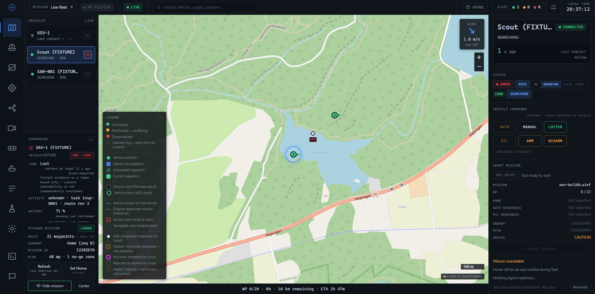
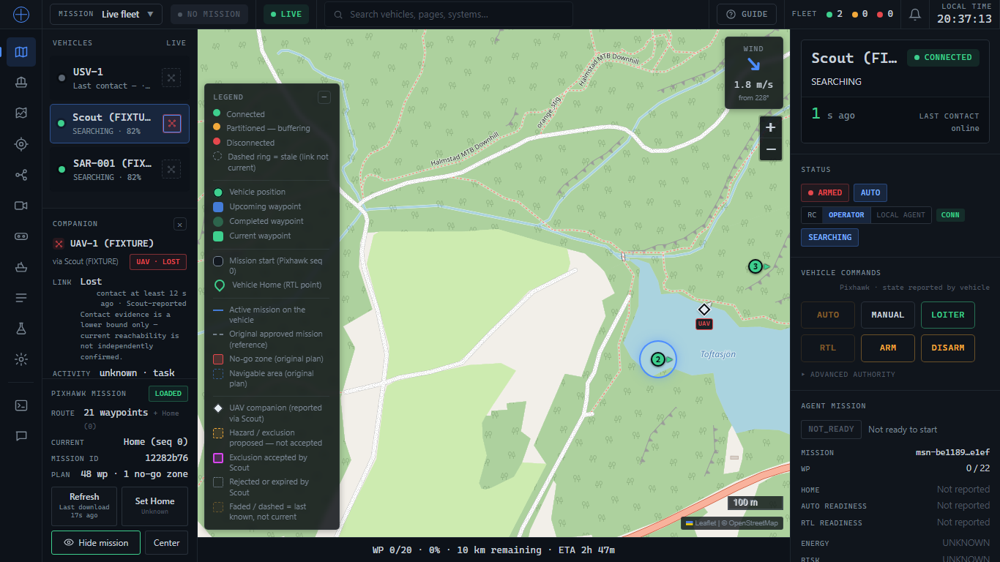
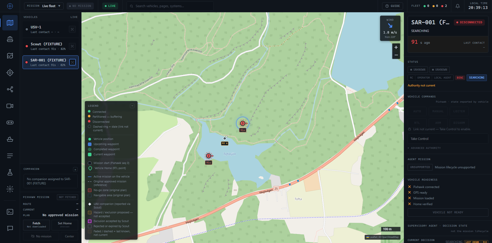

Page errors: none. Gotcha hit and worked around: a fresh browser profile auto-opens the
guided tour (`operator.tour.v1` in `localStorage`) whose backdrop intercepts the tab's click
— seeded `localStorage` before navigation in the verification driver only; the app itself is
unchanged.

## Automated (this pass)
- `tests/companion.test.mjs` — 39 tests (was 29): rewrote the dock-indicator tests around
  `companionTab()`/`CompanionTab()` (never/green/yellow/red/grey, LOST-with-no-history stays
  grey, Scout-stale stays grey, reconnection, unassignment + companion-replacement history
  isolation, a snapshot that no longer reports a companion cannot "restore" its history,
  deterministic multi-companion choice), added roster tests for the relocated battery and the
  opt-in/always-rendered tab, and updated the Map-wiring regression tests for the new call
  signature and toggle-close logic.
- Full suites: `npm test` 1082 passed; `python -m unittest tests.test_companion_telemetry`
  66 OK (backend untouched by this pass, run only to confirm no regression).

## Limitations / not verified (this pass)
- `link.ever_connected` remains unimplemented on Scout (proposed only, §11/§14 above) — the
  red state is therefore session-local: a page reload while a companion is genuinely LOST
  (but was connected earlier, before the reload) shows grey until a fresh CONNECTED/DEGRADED
  report is seen again in the new session. This is the deliberately conservative direction to
  err in (never a fabricated red) and is documented, not a bug.
- The small quadcopter glyph is abstract at the tab's compact size; it reads as a distinct
  non-circular shape from the round USV markers, which was the actual requirement, but is not
  a polished icon.
- Everything above is fixture/poster-driven; no real Scout has sent this block.
