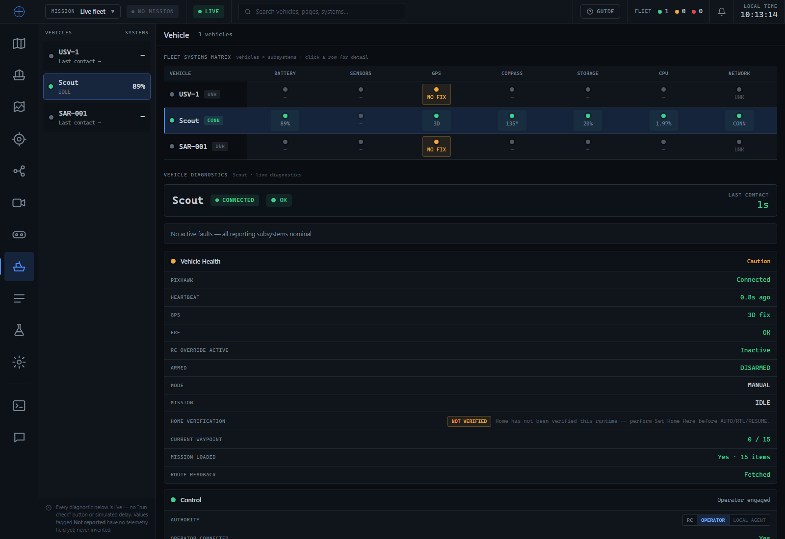

# Vehicle page — telemetry ingestion, normalization & rendering

Scope: make the Operator Station display the telemetry Scout already sends, and represent
genuinely-unavailable values honestly. No Scout code was touched. Mission execution,
replanning, mission hashing, planning, control authority and safety behaviour are
unchanged.

Captured live packet used throughout: `tests/fixtures/scout-status-live.json` — one real
`POST /agent/status` body from Scout's Local Agent, read back off the operator backend's
`GET /agent/status` while the vehicle was reporting at ~1 Hz.

---

## 1. What Scout actually sends (measured, not assumed)

`POST /agent/status` payload groups received by the operator backend:

```
usv_id  name  comm_state  groups  telemetry  power  failsafe  imu  freshness
mavlink  mission  communication  service_status  agent  health  measurements
events  transitions
```

Everything the audit asked about is present:

| Field | Received? | Value at capture |
|---|---|---|
| `power.*` | yes | 23.80 V · 0.21 A · 89 % · `PIXHAWK_BATTERY_MONITOR` |
| `failsafe.*` | yes | `status: OK`, `system_state: ACTIVE` |
| `imu.*` | yes | `imu_health: OK`, `imu_last_seen_s: 0.26` |
| `freshness.*` | yes | all eight streams, 0.26–0.5 s |
| `communication.operator_connected` | yes | `true` |
| `communication.rtt_ms` | yes | `331.1` |
| `communication.packet_loss` | yes (always null) | `null` — by design, the vehicle cannot know |
| `communication.seq` | yes | `302`, monotonic |
| `communication.vpn_status` | yes | `{wg0, up, RECENT_HANDSHAKE, 96.3 s, 1 peer}` |
| `service_status` | yes | 5 online, influx unknown |
| `telemetry.ekf_ok` | yes | `true` |
| `telemetry.gps_satellites` | yes | `20` |
| `mavlink.mavlink_connected` | yes | `true` |
| `health.temperature` | yes | `40.8` |
| `mission.mission_count` | yes | `15`, `current_waypoint_display: "0 / 15"` |
| `mission.pixhawk_readback` | yes | present, count 15, hash `sha256:347c101d…` |
| `agent.home_status.verified` | yes | `false` (a home position DOES exist, 1.6 km away) |
| `agent.current_policy` | yes | **an object**, not a string |
| `agent.current_behaviour` | **no** | nested inside `current_policy` |
| `agent.autonomy_level` | **no** | nested inside `current_policy` |

**The backend was dropping nothing.** `POST /agent/status` takes a raw `Request` and
stores the envelope verbatim (`rec["raw_latest"] = incoming`) — there is no Pydantic model
on that route, so no schema filtering ever occurred. Every failure below is downstream of
ingest: normalization, mapping, or rendering.

---

## 2. Audit table

Classification: `WORKING` · `BACKEND_MAPPING_BUG` · `STATE_MERGE_BUG` ·
`FRONTEND_MAPPING_BUG` · `FRONTEND_RENDER_BUG` · `INTENTIONALLY_UNKNOWN` ·
`NOT_RECEIVED_FROM_SCOUT`. (`BACKEND_SCHEMA_BUG` and `HARDWARE_OFFLINE` did not occur.)

| Row | Scout source | Received | Backend field | Frontend | Previous problem | Fix | Result |
|---|---|---|---|---|---|---|---|
| Pixhawk | `mavlink.heartbeat_age_s` | yes | `mavlink.heartbeat_age_s` | `pixhawkCell` | — | — | WORKING |
| Heartbeat | `mavlink.heartbeat_age_s` | yes | `mavlink.heartbeat_age_s` | `heartbeatCell` | — | — | WORKING |
| GPS fix | `telemetry.lat/lng` | yes | `lat`/`lng` | inline | — | — | WORKING |
| EKF | `telemetry.ekf_ok` | yes | `telemetry.ekf_ok` | `ekfRow` | row hardcoded `naRow("EKF")` | derive from `ekf_ok` | FRONTEND_MAPPING_BUG → fixed |
| RC override | authority controller | n/a | — | `rcActiveCell` | — | — | WORKING |
| Armed | `telemetry.armed` | yes | `telemetry.armed` | `armedCell` | — | — | WORKING |
| Mode | `telemetry.mode_name` | yes | `telemetry.mode` | `modeCell` | — | — | WORKING |
| Mission | `mission.mission_state` | yes | `mission_data.mission_state` | inline | — | — | WORKING |
| Home verification | `agent.home_status.verified` | yes | `home.verified` | `homeStatus` + `homeVerificationRow` | logic correct; Scout's reason was hidden | surface `home.reason` beside the chip | WORKING (hardened) |
| Current waypoint | `mission.current_waypoint_display` | yes | `mission_status.current_waypoint_display` | `currentWaypointRow` | answered only from the on-demand readback proxy → "NOT FETCHED" | read Scout's continuous field | FRONTEND_MAPPING_BUG → fixed |
| Mission loaded | `mission.mission_count` | yes | `mission_status.mission_count` | `missionLoadedRow` | same; conflated presence with readback | split into two rows | FRONTEND_MAPPING_BUG → fixed |
| Route readback (new) | `mission.pixhawk_readback` | yes | `mission_status.readback` | `missionReadbackRow` | did not exist | new row | WORKING |
| Battery voltage | `power.battery_voltage_v` | yes | `power.battery_voltage_v` | `batteryVoltageRow` | hardcoded `naRow` + no backend field | new `power` block + row | BACKEND_MAPPING_BUG + FRONTEND_MAPPING_BUG → fixed |
| Battery current | `power.battery_current_a` | yes | `power.battery_current_a` | `batteryCurrentRow` | as above | as above | fixed |
| Power source | `power.source` | yes | `power.source` | `powerSourceRow` | as above | as above, humanized | fixed |
| Remaining % | `power.battery_remaining_pct` | yes | `power.battery_remaining_pct` | `batteryRemainingRow` | read `telemetry.battery`, which carries MAVLink's `-1` | prefer the canonical pct; `-1` → absence | fixed |
| Failsafe | `failsafe.status` | yes | `failsafe.status` | `failsafeRow` | hardcoded `naRow` | new block + observation-phrased wording | fixed |
| WireGuard | `communication.vpn_status` | yes | `link.vpn` | `wireguardRow` | `naRow("no VPN telemetry field")` | new block + 5 semantic states | fixed |
| Operator Backend | operator feed health | n/a | — | `operatorBackendCell` | — | — | WORKING |
| Local Agent | arrival age | n/a | `online` | inline | — | — | WORKING |
| MAVLink | `mavlink.mavlink_connected` | yes | `mavlink.connected` | `mavlinkRow` | backend read `mav.connected` / `last_msg_age_s` / `msg_rate_hz` — spellings Scout does not send → all null → NO TELEM | read the real spellings | **BACKEND_MAPPING_BUG** → fixed |
| Telemetry freshness | arrival age | n/a | `comm_state` | inline | — | unchanged by design | WORKING |
| Packet loss | `communication.seq` | yes | `link.packet_loss` | `packetLossRow` | `naRow("future")` | operator-side estimator | fixed |
| RTT | `communication.rtt_ms` | yes | `link.rtt_ms` | `rttRow` | `naRow("future")` | new block + row | fixed |
| Current behaviour | `agent.current_policy.current_behaviour` | yes (nested) | `agent_summary.current_behaviour` | `agentRows` | read `agent.current_behaviour`, which does not exist → "NOT EMITTED" | read the nested field | FRONTEND_MAPPING_BUG → fixed |
| Current decision | `agent.current_decision` | yes | `agent_summary.current_decision` | `agentRows` | — | — | WORKING |
| Current policy | `agent.current_policy` (object) | yes | `agent_summary.current_policy` | `agentRows` | `String(object)` → **`[object Object]`** | flatten to a string, backend + frontend | **FRONTEND_RENDER_BUG** → fixed |
| Autonomy level (new) | `agent.current_policy.autonomy_level` | yes | `agent_summary.autonomy_level` | `agentRows` | did not exist | new row | WORKING |
| Control authority | `/api/control_authority/{id}` | n/a | — | `AuthoritySeg` | — | — | WORKING |
| Decision reason | `agent.decision_reason` | yes | `agent_summary.decision_reason` | `agentRows` | — | — | WORKING |
| GPS coordinates | `telemetry.lat/lng` | yes | `lat`/`lng` | inline | — | — | WORKING |
| GPS satellites | `telemetry.gps_satellites` | yes | `telemetry.gps_satellites` | `gpsSatellitesRow` | hardcoded `naRow` | derive | FRONTEND_MAPPING_BUG → fixed |
| Compass | `telemetry.heading` | yes | `heading` | inline | — | — | WORKING |
| IMU | `imu.imu_health` | yes | `imu.health` | `imuRow` | hardcoded `naRow` | new block + summary-only row | fixed |
| Camera | — | **no** | `service_status.camera` (absent) | `cameraRow` | generic NO TELEM | "not reported by this vehicle" | NOT_RECEIVED_FROM_SCOUT |
| Sonar / bathymetry | `measurements.sampling.enabled` | yes | `sampling.enabled` | `bathymetryRow` | read `measurements.bathymetry` (never sent) | report the provable "sampling disabled" | FRONTEND_MAPPING_BUG → fixed |
| Leak sensor | `health.system.leak_sensor` | yes | `leak_sensor.state` | `leakSensorRow` | read `health.leak_detected` (always null) → NO TELEM; matrix also claimed a flat "OK" | `UNCALIBRATED` state; matrix cell no longer asserts health | FRONTEND_MAPPING_BUG → fixed |
| CPU | `health.cpu_load` | yes | `health.cpu_load` | inline | — | — | WORKING |
| Memory | `health.ram_usage` | yes | `health.ram_usage` | inline | — | — | WORKING |
| Temperature | `health.temperature` | yes | `health.temperature` | `temperatureRow` | hardcoded `naRow` | derive | FRONTEND_MAPPING_BUG → fixed |
| Disk usage | `health.disk_usage` | yes | `health.disk_usage` | inline | — | — | WORKING |
| Service status | `service_status` | yes | `service_status` | `serviceStatusRow` | read `health.flask_status` (never sent) | new block + summary, detail on hover | FRONTEND_MAPPING_BUG → fixed |
| Firmware | — | **no** | — | `naRow` | showed the *status message* schema version labelled "Firmware" | split: "Status schema v1.0" + "Firmware — not reported" | NOT_RECEIVED_FROM_SCOUT |
| Operator connected | `communication.operator_connected` | yes | `link.operator_connected` | `operatorConnectedRow` | read `operator_reachable` only | use the canonical field, fall back to reachable | fixed |
| *(all groups)* | any partial packet | — | `stale_groups` | — | a packet omitting a group blanked that group for one poll | group-level last-known carry-forward | **STATE_MERGE_BUG** → fixed |

---

## 3. Merge semantics (documented, not incidental)

`last_known_groups` in `main.py`, applied by `vehicle_telemetry.effective_group`:

* a group **present** in a packet is **authoritative** and replaces the stored one
  wholesale — Scout emits full group snapshots, so deep-merging fields would resurrect a
  reading Scout deliberately stopped sending;
* a group **absent** from a packet is a **partial update, not a clear** — the vehicle's
  last snapshot is reused and named in the row's `stale_groups`;
* the one documented exception is `telemetry`, whose individual **fields** are also
  carried forward (`last_known_telemetry`), because MAVLink legitimately drops fields
  mid-stream and sends `battery = -1` for "unknown";
* every store is keyed by canonical vehicle id, so usv-3 can never read, overwrite, or
  age usv-2's state.

## 4. Packet-loss estimator

**Definition:** the fraction of the Local Agent's outbound status messages, in the last
120 s, that never arrived at this operator station. It is *not*
`SYS_STATUS.drop_rate_comm` (that measures the Pixhawk↔Pi serial link and says nothing
about the 4G/WireGuard path).

Only the receiver can measure it, so Scout stamps `communication.seq` and the arithmetic
lives in `vehicle_telemetry.PacketLossEstimator`, one instance per vehicle:

```
expected = newest_seq - oldest_seq + 1      (within the 120 s window)
received = count of UNIQUE seq in the window
lost     = max(0, expected - received)
loss_pct = 100 * lost / expected
```

Every ambiguous case degrades to **unmeasured**, never to a dramatic number:

| Case | Behaviour |
|---|---|
| < 20 samples | `UNMEASURED`, `loss_pct: null` — never a fabricated 0 % |
| duplicate seq | counted once; `received` can never exceed `expected` |
| out-of-order seq | fills its gap retroactively — reduces loss, never creates it |
| counter restart (seq below the whole window) | window discarded, measurement restarts |
| forward jump > 1000 | treated as a reinit, not as 1000 lost packets |
| long outage | old samples age out; a reconnect reports "measuring", not 95 % |
| vehicle sends no seq | never becomes measurable |

Arrival is recorded for **every** packet that physically reaches the backend, including
one rejected by the monotonic-timestamp guard — it arrived, so counting it as lost would
overstate how bad the link is.

---

## 5. Manual UI validation — usv-2 (Scout)

Preconditions: Scout reporting at ~1 Hz; operator backend on `:8210`; open
`http://127.0.0.1:8210/app/#/vehicle` and select **Scout**.

| Row | Expected |
|---|---|
| **Vehicle Health** | |
| Pixhawk | `Connected` |
| Heartbeat | fresh, < 3 s |
| GPS | `3D fix` |
| EKF | `OK` — **not** NO TELEM |
| Armed | `DISARMED` |
| Mode | `MANUAL` |
| Mission | `IDLE` |
| Home verification | `NOT VERIFIED` + Scout's Set-Home reason — **not** VERIFIED |
| Current waypoint | `0 / 15` — **not** NOT FETCHED |
| Mission loaded | `Yes · 15 items` |
| Route readback | `Fetched` / `Available on vehicle` |
| **Power** | |
| Battery voltage | `~23.8 V` |
| Battery current | `~0.2 A` (a genuine `0.00 A` must still render) |
| Power source | `Pixhawk battery monitor` — not the raw token |
| Remaining % | `~89 %` |
| Failsafe status | `No active failsafe observed` |
| **Communication** | |
| WireGuard | `Recent handshake` + `wg0 · handshake N s ago · 1 peer` |
| Operator Backend | `Live` |
| Local Agent | `Online` |
| MAVLink | `Connected` + heartbeat age |
| Telemetry freshness | `~1s · CONNECTED` |
| Packet loss | `— measuring N / 20 samples` for the first ~20 s, then `0.0%` |
| RTT | `~300–400 ms` |
| **Local Agent** | |
| Current behaviour | `Monitoring` — **not** NOT EMITTED |
| Current decision | `Hold Position` |
| Current policy | `Full reporting` — **never** `[object Object]` |
| Autonomy level | `Assisted` |
| Decision reason | `No mission assigned; standing by.` |
| **Sensors** | |
| GPS satellites | `~20–25` |
| Compass | `135°` |
| IMU | `OK` + age |
| Camera | `— not reported by this vehicle` |
| Sonar / bathymetry | `Sampling disabled` |
| Leak sensor | `Uncalibrated` — **never** `No leak` / `Safe` / `LEAK` |
| **System** | |
| Temperature | `~41 °C` |
| Service status | `5 online · 1 unknown`; hover shows the per-service list |
| Status schema | `v1.0` |
| Firmware | `— not reported by this vehicle` |
| **Fleet matrix** | Scout's *Sensors* cell reads `—`, not a green `OK` |

Then: **watch for ~10 s across at least 5 polls.** No populated row may flicker to `—`.

---

## 6. Verification run — 2026-08-08

Driven headless (Playwright) against the live backend with Scout reporting.



Scraped rows:

```
Vehicle Health   Pixhawk Connected · Heartbeat 0.8s ago · GPS 3D fix · EKF OK
                 RC override Inactive · Armed DISARMED · Mode MANUAL · Mission IDLE
                 Home verification NOT VERIFIED (Scout's reason shown)
                 Current waypoint 0 / 15 · Mission loaded Yes · 15 items
                 Route readback Fetched
Control          Authority OPERATOR · Operator connected Yes · RC override policy Always
Power            23.76 V · 0.16 A · Pixhawk battery monitor · 89% ·
                 No active failsafe observed
Communication    WireGuard Recent handshake (wg0 · handshake 1 s ago · 1 peer)
                 Operator Backend Live · Local Agent Online
                 MAVLink Connected (heartbeat 0.82 s ago · 0.59 Hz)
                 Telemetry freshness 1s · CONNECTED
                 Packet loss 0.0% (0 of 62 in 120 s) · RTT 337 ms
Local Agent      Monitoring · Hold Position · Full reporting (mission Supervised
                 continuation) · Assisted · "No mission assigned; standing by."
Sensors          56.66354, 12.88143 · 24 sats · 135° · IMU OK (0.12 s ago)
                 Camera — not reported by this vehicle
                 Sonar Sampling disabled · Leak sensor Uncalibrated (signal LOW)
System           CPU 1.97% · Memory 34.9% · Temperature 41.4 °C · Disk 20%
                 Service status 5 online · 1 unknown · Status schema v1.0
                 Firmware — not reported by this vehicle
```

* `[object Object]` anywhere in the page body: **false**
* JS console/page errors: **none**
* Rows flickering to `—` across a second poll: **none**

Automated: `python -m unittest discover -s tests` → **890 passed**;
`npm test` → **772 passed**.

---

## 7. Deliberately still unknown, and why

| Row | State | Why |
|---|---|---|
| Camera | not reported by this vehicle | Scout emits no camera field, service, or health entry. Rendering "Offline" would imply a camera exists and has failed. |
| Firmware | not reported by this vehicle | Scout sends no autopilot/vehicle firmware version. The old row showed the status *message* schema version under a Firmware label. |
| Leak sensor | Uncalibrated | The pin is readable (`signal: LOW`) but `polarity: uncalibrated` — nobody has established whether LOW means dry or flooded, so `leak_detected` is null. Rendering "Safe" would be a dangerous lie. |
| Sonar / bathymetry | Sampling disabled | `measurements.sampling.enabled: false` — provably off, not missing. |
| `communication.packet_loss` (vehicle's own) | null | By design: the vehicle cannot know which of its sends we failed to receive. The operator measures it instead. |
| `communication.local_state_available` | null | Present on Scout's Flask `/agent/state` but not in the Local Agent's outbound POST. Not required by any row. |
| `mavlink.parser_errors` | null | Scout does not populate it. Not used as an availability test. |

## 8. Technical debt left unchanged

* The **fleet matrix GPS cell** still derives "3D"/"NO FIX" from position presence rather
  than `telemetry.gps_fix_type`. Out of scope here; the Vehicle Health GPS row does the
  same and was explicitly listed as acceptable.
* `mavlink_evidence()` in `main.py` remains as a thin wrapper over
  `vehicle_telemetry.mavlink_block` purely to keep the legacy `last_heartbeat` /
  `last_msg_time` timestamp spellings working for a pre-update Local Agent.
* `stale_groups` is published on every fleet row but no page renders it yet — it is the
  hook for marking a carried-forward group as LAST KNOWN in the UI.
* The `[STATUS]` log line still interpolates a non-ASCII em-dash for an absent mission
  state, which the Windows console renders as `?`. Pre-existing; untouched.
